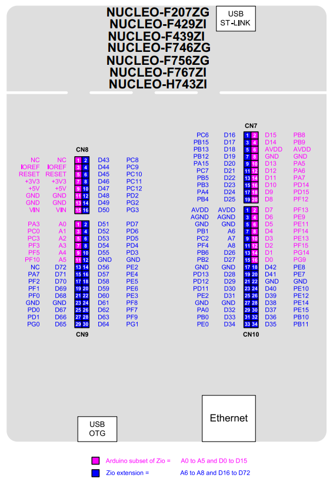

# NucleoRelayProp
*Universal Relay Prop for Escape Room with STM32 Nucleo-144  connected with Ethernet.*

In your Escape Room, *PiPyRelayProp* centralizes the control of your main relays:
* lights
* electricity
* maglocks (doors)
* smoke machines (warmp-up and shots)

No coding is required, the relay outputs are configured with the [PyRelayControl](https://github.com/xcape-io/RelayProp/tree/master/PyRelayControl) wiring GUI and the commands can be triggered with the [PyRelayControl](https://github.com/xcape-io/RelayProp/tree/master/PyRelayControl) panel or a regular [control panel for *Room by xcape.io* users](https://github.com/xcape-io/RelayProp/tree/master/NucleoRelayProp#prop-configuration-for-room-by-xcapeio).


* [Prepare Arduino IDE and Nucleo](https://github.com/xcape-io/RelayProp/tree/master/NucleoRelayProp#prepare-arduino-ide-and-nucleo)
* [Installation for STM32 Nucleo-144 (F767ZI)](https://github.com/xcape-io/RelayProp/tree/master/NucleoRelayProp#installation-for-dragino-yun-ethernet-or-wifi-shield)
* [Relay Prop wiring and control panel](https://github.com/xcape-io/RelayProp/tree/master/NucleoRelayProp#relay-prop-wiring-and-control-panel)
* [Relay modules](https://github.com/xcape-io/RelayProp/tree/master/NucleoRelayProp#relay-modules)
* [Prop commands](https://github.com/xcape-io/RelayProp/tree/master/NucleoRelayProp#prop-commands)
* [Prop data messages](https://github.com/xcape-io/RelayProp/tree/master/NucleoRelayProp#prop-data-messages)
* [Prop configuration for *Room by xcape.io*](https://github.com/xcape-io/RelayProp/tree/master/NucleoRelayProp#prop-configuration-for-room-by-xcapeio)


## Prepare Arduino IDE and Nucleo
You will find instructions in the <a href="https://github.com/xcape-io/ArduinoProps#1-installation-and-usage" target="_blank">ArduinoProps.md (1. Installation and usage)</a> to install:
* **ArduinoProps** library
* **PubSubClient** library
* **ListLib** library

Next you need to install **ArduinoJson** library:


Then add STM32 boards in the Boards Manager, adding `package_stm_index.json` to **Additional Boards Manager URLs** in **Preferences**:

URL to add: `https://github.com/stm32duino/BoardManagerFiles/raw/master/STM32/package_stm_index.json`

Eventually, install STM32 libraries:
* **STM32duino Examples**
* **STM32duino LwIP**
* **STM32duino STM32Ethernet**

## Installation for STM32 Nucleo-144 (F767ZI)
Download <a href="https://github.com/xcape-io/RelayProp/archive/master.zip" target="_blank">`RelayProp-master.zip`</a>, the sketch `NucleoRelayProp.ino` is in the **NucleoRelayProp** folder in  `RelayProp/NucleoRelayProp/`.

Advanced users may clone the <a href="https://github.com/xcape-io/RelayProp" target="_blank">https://github.com/xcape-io/RelayProp</a> repository.

Open the `NucleoRelayProp.ino` sketch in the Arduino IDE to set MQTT topics for your Escape Room:
```c
NucleoRelayProp prop(u8"Relay Nucleo", // as MQTT client id, should be unique per client for given broker
                   u8"Room/My room/Props/Relay Nucleo/inbox",
                   u8"Room/My room/Props/Relay Nucleo/outbox",
                   u8"Room/My room/Props/Relay Nucleo/wiring/#",
                   "192.168.1.42", // your MQTT server IP address
                   1883); // your MQTT server port;
                   
```

Then upload the sktech to the Relay Mega board.


## Relay Prop wiring and control panel
All relay outputs are setup with the *PyRelayControl* GUI:


See [PyRelayControl](https://github.com/xcape-io/RelayProp/tree/master/PyRelayControl)


## Relay modules
See [RELAY_MODULES.md](https://github.com/xcape-io/RelayProp/blob/master/RELAY_MODULES.md)

STM32 Nucleo-144 boards expose the **ST Zio connector**, which extends the Arduino Uno V3 connectivity with 73 digital outputs (`D0` to `D72`).




## Prop commands
Commands are implicitly defined with the *PyRelayControl* GUI, you can create group commands by naming variables in groups with the `/` separator.

Relay commands are built from the variable name:

* `props:on` : power on the props
* `smoke/on:1` : ower on the smoke machine
* `smoke/fog:1` : release fog from the smoke machine

Group commands uses the `/*` tag: 

* `maglock/*:0` : release all the maglocks
* `door/*:0` : open all the doors


## Prop data messages
Relay state variables are sent as defined with the *PyRelayControl* GUI, as well as the board and settings informations:

```yaml
wiring:
    0: not configured
    1 to 73: number of pins configured

board:
    STM32 Nucleo-144
```

For example:

```bash
board=STM32 Nucleo-144 
wiring=9 
```


## Prop configuration for *Room by xcape.io*
*Room by xcape.io* users can add the Relay Pi prop to their props:


And create a regular control panel:


## Author

**Faure Systems** (Jun 28th, 2020)
* company: FAURE SYSTEMS SAS
* mail: *dev at faure dot systems*
* github: <a href="https://github.com/xcape-io?tab=repositories" target="_blank">xcape-io</a>
* web: <a href="https://xcape.io/" target="_blank">xcape.io</a>