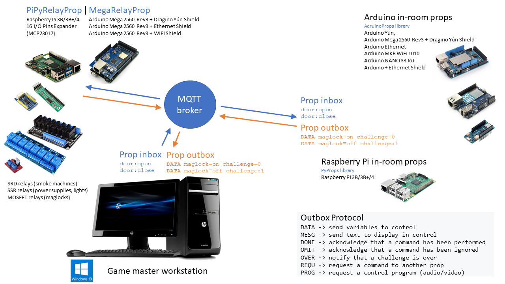

# Relay Prop
*__No-code__ prop and control panel to command relays with Arduino Mega 2560 or Raspberry Pi board.*

For eihter the Arduino Mega or the Raspberry Pi, you just have to install the code provided in [MegaRelayProp](./MegaRelayProp) or [PiPyRelayProp](./PiPyRelayProp).

Use [PyRelayControl](./PyRelayControl) GUI app on Windows or Linux desktop (Mac OSX should work too) to configure the Arduino Mega or the Raspberry Pi board and your wiring.

The configuration is stored locally in a JSON file and in a topic of the MQTT broker.


<hr>

This repository contains 3 projects:
* [MegaRelayProp: Relay Prop on Arduino Mega 2560](./MegaRelayProp)
* [PiPyRelayProp: Relay Prop on Raspberry Pi (3B/3B+/4)](./PiPyRelayProp)
* [PyRelayControl: control panel for Relay Prop](./PyRelayControl)

And a guide for relay modules:
* [RELAY_MODULES.md](./RELAY_MODULES.md)


## Usage

1. Choose if you will use Arduino Mega or Raspberry Pi board
2. Intall on your local network, either:
    * [MegaRelayProp: Relay Prop on Arduino Mega 2560](./MegaRelayProp)
    * [PiPyRelayProp: Relay Prop on Raspberry Pi (3B/3B+/4)](./PiPyRelayProp)
3. Install an <a href="https://xcape.io/public/documentation/en/room/MQTTserver.html" target="_blank">MQTT broker</a> on your local network, eihter:
    * _<a href="https://mosquitto.org/download/" target="_blank">mosquitto</a>_ on a Raspberry Pi which is my preferred choice
    * _<a href="https://mosquitto.org/download/" target="_blank">mosquitto</a>_ on your desktop
4. Install [PyRelayControl](./PyRelayControl) on your desktop
5. Start [PyRelayControl](./PyRelayControl) GUI and configure your relays wiring (GPIO)
6. Upload the wiring to the MQTT broker (one-click)
7. Automatically build the control panel widgets (one-click)
8. Customize the control panel widgets (labels and images)
9. Enjoy controlling your relays from the control panel


## Why do we need a Relay prop in our Escape Room?
Our goal is to give most of the electrical control to a central accessory located near the Game Master's computer or in the room's central electric cabinet.

### Benefits
* Provide power reboot for in-room props
* Most of relay modules are centralized and accessible
* Centralized 12V supply for door maglocks
* Reduce support costs with centralization and accessibility
* Centralized power shutdown to reduce electricity bills
* Inexpensive to wire the escape room like a house (star wiring)


### Recommended room network (star wiring)


### Raspberry Pi or Arduino Mega ?
For the Relay prop we recommend and provide code for Raspberry Pi and Arduino Mega.

#### Raspberry Pi 
Good choice for Python enthusiasts because we need an MQTT broker for the Escape Room and the Relay Prop on a Raspberry board can run the `mosquitto` broker.

Raspberry Pi doesn't expose a lot of pins:
* 25 pins available
* 39 pins with one 16 Pins I/O Expanders with <a href="https://www.microchip.com/wwwproducts/en/MCP23017" target="_blank">MCP23017</a> connected thru I2C

Examples of <a href="https://www.microchip.com/wwwproducts/en/MCP23017" target="_blank">MCP23017</a> expanders:
* <a href="https://www.waveshare.com/wiki/MCP23017_IO_Expansion_Board" target="_blank">Waveshare MCP23017 IO Expansion Board</a>
* <a href="https://www.amazon.fr/gp/product/B07GFQY5DW" target="_blank">Sharplace MCP23017 I/O Expander</a>

#### Arduino Mega
Good choice for people who prefer coding Arduinos rather than Python.

<a href="https://store.arduino.cc/arduino-mega-2560-rev3" target="_blank">Arduino Mega 2560</a> expose a lot of I/O: 
* 50 pins available (48 with Dragino Yún Shield)
* we don't use analog pins (due to Arduino memory constraints)

#### Do we connect the Arduino Mega with Dragino Yún or Ethernet or WiFi shield?
WiFi shield may not make much sense because in central wiring you should have a centralized Ethernet switch.

You can use the Ethernet shield coupled to a USB cable connecting the Arduino Mega to the Game Master computer. Thus, you can program the Arduino Mega from the Game Master computer and possibly remotely with <a href="https://www.teamviewer.com/" target="_blank">TeamViewer</a>.

With the Dragino Yún shield, you don't need a USB cable to program the Arduino Mega from the Game Master computer and possibly remotely with <a href="https://www.teamviewer.com/" target="_blank">TeamViewer</a> (this is what we recommend for in-room Arduino props).

> D0 (RxD) and D1 (TxD) are used by the Arduino Bridge connection.
> Ethernet and WiFi shield are connected to Arduino with SPI port.


## MegaRelayProp project
For the Relay Prop Arduino sketch to run on Arduino Mega 2560 see `MegaRelayProp.ino` sketch in [MegaRelayProp](./MegaRelayProp).

The `MegaRelayProp.ino` sketch includes `MegaRelayProp` class that extends `Props` class from <a href="https://github.com/xcape-io/ArduinoProps" target="_blank">ArduinoProps library</a>.

The Relay Prop inbox/outbox MQTT topics are:
```csharp
Room/[escape room name]/Props/[props name]/inbox
Room/[escape room name]/Props/[props name]/outbox

example:
    /Room/My Room/Props/Relay Mega/inbox
    /Room/My Room/Props/Relay Mega/outbox
```

`MegaRelayProp.ino` sketch supports:
* Arduino Mega 2560 + Dragino Yún Shield
* Arduino Mega 2560 + Ethernet Shield
* Arduino Mega 2560 + WiFi Shield

See [MegaRelayProp: Room Relay Prop on Arduino Mega 2560](./MegaRelayProp).


## PiPyRelayProp project
[PiPyRelayProp](./PiPyRelayProp) is the Python application to run on Raspberry Pi for the Relay Prop.

The Relay Prop inbox/outbox MQTT topics are:
```python
Room/[escape room name]/Props/[props name]/inbox
Room/[escape room name]/Props/[props name]/outbox

example:
    /Room/My Room/Props/Relay Pi/inbox
    /Room/My Room/Props/Relay Pi/outbox
```

See [PiPyRelayProp: Room Relay Prop on Raspberry Pi (3B/3B+/4)](./PiPyRelayProp).


## PyRelayControl project
[PyRelayControl](./PyRelayControl) is the prop control panel for the Relay Prop, it's a PyQt5 GUI application to configure the Relay Prop.

We usually run PyRelayControl <a href="./PyRelayControl#installation-on-windows" target="_blank">on Windows</a> but you can install and run it <a href="https://www.learnpyqt.com/installation/installation-linux/" target="_blank">on Linux</a> and Mac, <a href="https://www.learnpyqt.com/installation/installation-mac/" target="_blank">PyQt5 installation on Mac</a> can be tricky.

You can run [PyRelayControl](./PyRelayControl) as a *plugin for <a href="https://xcape.io/" target="_blank">xcape.io</a> Room*.


## TODO
* Add MPC23017 support
* Add Mega without bridge support


## Author

**Marie FAURE** (Jun 4th, 2020)
* company: FAURE SYSTEMS SAS
* mail: *dev at faure dot systems*
* github: <a href="https://github.com/xcape-io?tab=repositories" target="_blank">xcape-io</a>
* web: <a href="https://xcape.io/" target="_blank">xcape.io</a>