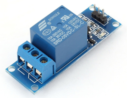
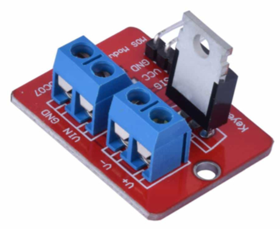
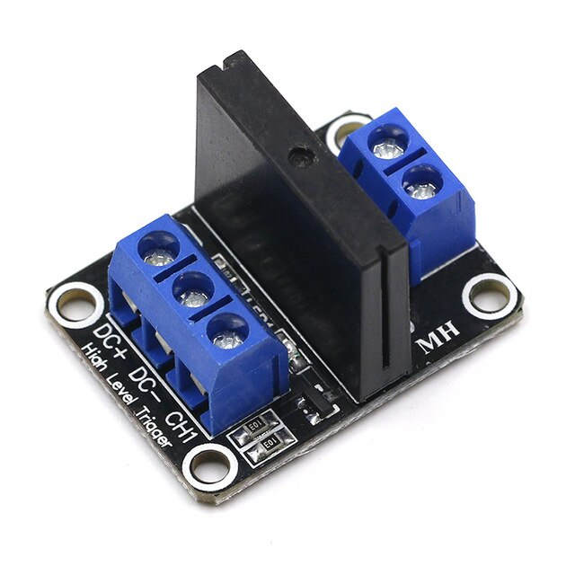

# Relay modules
*Preferred relay modules for Escape Room.*

* [SRD relays: AC-DC, high power](#srd-relays-ac-dc-high-power)
* [MOSFET relays: DC, high power](#mosfet-relays-dc-high-power)
* [SSR relays: AC, 2A max](#ssr-relays-ac-2a-max)

## SRD relays: AC-DC, high power

| Feature                |                                        |
|------------------------|----------------------------------------|
| Maximum AC-DC voltage  | 250VAC/30VDC                           |
| Maximum current        | 10A                                    |
| Current breaking       | Mechanic (magnetic field)              |
| NO/NC connectors       | Normally Open and Normally Connected   |
| Usage                  | Smoke machines (440W/1500W)            |
| Bill Of Materials      | $20 for 8-SRD-relay module             |

The most common relay, SRD stands for Short Range Device. The power circuit is isolated from the control circuit, activation is by magnetic field.

Due to its mechanical cut-off system and the poor quality of parts available on the consumer market, they are not as reliable as their technical data sheet supports.

Therefore, I recommend installing 8 relays when you need 6 so replacement will be quick.

> **Unreliable so install 8-SRD module when you need 6**

We recommend limiting their use to smoke machines or other high power devices (> 2A VAC) ***which are not used for high frequency switching***.

## MOSFET relays: DC, high power

| Feature                |                                             |
|------------------------|---------------------------------------------|
| Maximum voltage        | 24VDC (MOSFET drivers are DC only)          |
| Maximum current        | 5A                                          |
| Current breaking       | MOSFET transistor                           |
| No NC connector        | Normally Open only                          |
| Usage                  | Maglocks, high power LEDs, linear actuators |
| Bill Of Materials      | $20 for 8-MOSFET-driver module              |

More and more used in escape rooms, MOSFET drivers are reserved for DC switching. 

With no mechanical cut-off system, they are very reliable and fast.

> **DC only, MOSFET modules can be used for high frequency DC switching**

For devices of inductive nature (maglock, linear actuator), ***I recommend adding a protective diode on the output***.

## SSR relays: AC, 2A max

| Feature                |                                               |
|------------------------|-----------------------------------------------|
| Load voltage range     | 75 to 264VAC (50/60Hz)                        |
| Load current range     |  0.1 to 2A                                    |
| Current breaking       | AC-only Solid State Relay                     |
| No NC connector        | Normally Open only                            |
| Usage                  | Lightnings, in-room props 220/110VAC supplies |
| Bill Of Materials      | $20 for 8-SSR-relay module                    |

SSR stands for Solid State Relay. Most SSR relays available on the consumer market are VAC only.

With no mechanical cut-off system, they are very reliable and fast.

> **AC only, SSR modules can be used for high frequency AC switching**

More and more affordable, SSR modules are becoming more and popular.

> **DO NOT connect the power circuit WHILE the module is ON (the SSR relay will explode)**

## Author

**Marie FAURE** (Apr 27th, 2020)
* company: FAURE SYSTEMS SAS
* mail: *dev at faure dot systems*
* github: <a href="https://github.com/xcape-io?tab=repositories" target="_blank">xcape-io</a>
* web: <a href="https://xcape.io/" target="_blank">xcape.io</a>